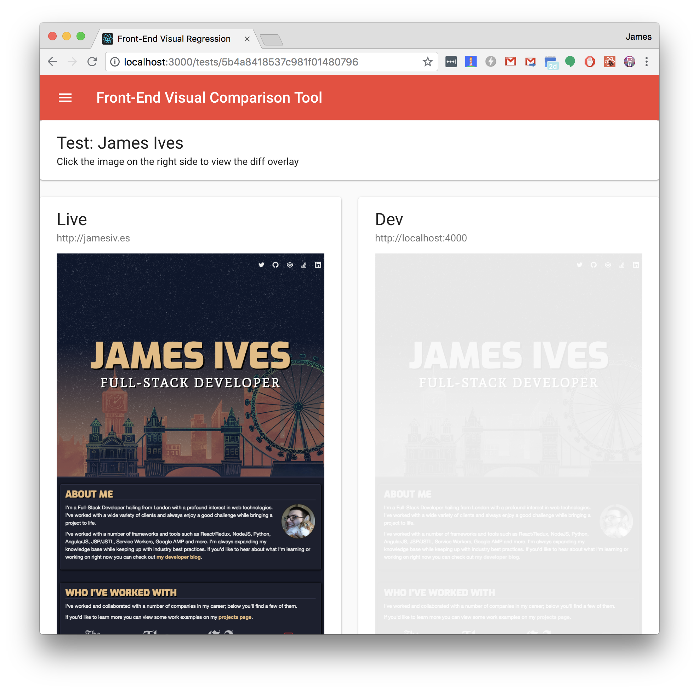

# Front-End Visual Comparison Tool
This application runs a side by side visual comparison between the Front-End of your local developer environment and your production site with Chrome. Once the tests have concluded a you'll be able to view the comparison side by side in the applications interface.

## Getting Started
Clone this repository, or simply download it as a zip. This project is database driven so test data can be persisted, therefore you'll need to start up a local [MongoDB](https://www.mongodb.com/) database and create/import the path into a file called `config/database.config.js` like so:

```javascript
module.exports = {
  url : 'mongodb://localhost:27017/testdb'
};
```

Once you've added your database path you can run the following commands in order. This will install the required dependencies for the client and the Node service and then start the service.

```shell
$ npm install && cd ./client/ && npm install && cd ../
$ npm start
```

Once the service is started you can access the local interface at http://localhost:3000. The API service runs on port 9090.

## Creating/Running a Test
Within the interface you can add a test by clicking the `Create Test` option within the pullout menu. On the `Create Test` page you'll be prompted to fill in multiple fields of data.

| Option | Description | Required |
| ------------- | ------------- | ------------- |
| `Name`  | This should represent the name of your test. For example `Blog Page` or something similar.  | `Required` |
| `Description`  | This should give a brief description about what your test is about. For example `The mobile blog page`. | `Optional` |
| `Live URL`  | This should be a fully qualified url for your current page that is in production, or on your staging environment. This is the base for the visual comparison. Visual comparisons work best for static pages, therefore it may be a good idea to create a kitchen sink page that will store your components in a static state. | `Required` |
| `Dev URL`  | This should be a fully qualified url for your page that is under development. For instance this could point to your local page on localhost.  | `Required` |
| `Browser Size`  | The browser width that you'd like to run the test at. If you're developing a mobile page then you can set this to a mobile browser width and the test will run at that size.  | `Optional` |

Once the test has been created you can access the test page and select the `Run Test` button to begin the test, once concluded the page will refresh and you'll be able to see the comparisons. Once the comparisons are available you can click on the dev page screenshot to toggle the overlay which will highlight the changes.

You can re-run the test as many times as you like. If there's an error with the test, such as one of the paths being unavailable, the interface will alert you that there was a problem. From the test page you're also able to edit and remove the test if you've made a mistake or if you no longer have a need for it.

## API
There are several API endpoints which can be utilized if you'd prefer to not use the interface. Screenshots get saved by default in the `./client/public/diff` directory, you can modify this location by editing the [database.config.js](config/database.config.js) file.

| Endpoint | Type | Description |
| ------------- | ------------- | ------------- |
| `/tests`  | `GET` | Fetches all tests, returns an array. |
| `/tests`  | `POST` | Adds a test, accepts a JSON object with the properties `name`, `description`, `live`, `dev`, and `size`. |
| `/tests/:id`  | `GET` | Fetches a specific test based on its id. |
| `/tests/:id`  | `PUT`  | Updates a specific test, accepts a JSON object with the properties `name`, `description`, `live`, `dev` and `size`. |
| `/tests/:id`  | `DELETE`  | Deletes a specific test. |
| `/run`  | `GET`  | Runs all tests that are stored in the database. Eventually returns an array containing all of the tests with a `success` flag that will either be `true` or `false` depending on if the test resulted in an error or not. |
| `/run/:id`  | `GET`  | Runs a specific test. Returns the test object with a `success` flag that will be either `true` or `false` depending on if the test resulted in an error or not. |

You can find an example response from the API below.

```javascript
[
    {
        "_id": "5b5359913a6b910586b1345b",
        "name": "Blog Page",
        "description": "My Blog Page",
        "live": "https://jamesiv.es/blog",
        "dev": "http://localhost:4000/blog",
        "size": 728
    }
]
```

## Issues, Feedback and Questions
Please post any issues, feedback, or questions [here](https://github.com/JamesIves/front-end-visual-comparison/issues).


